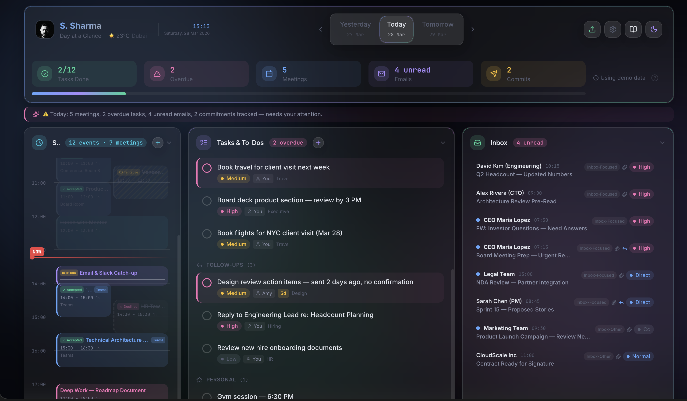
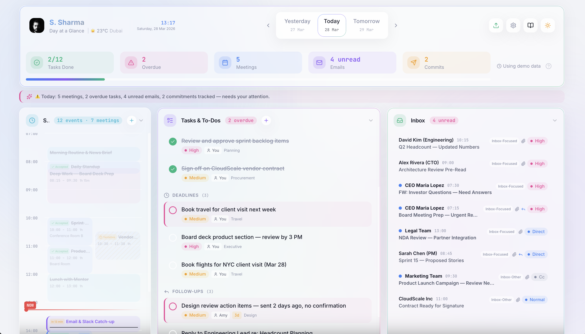

<div align="center">

# 🖥️ Chapter 2: Dashboard Overview

**Everything on one screen. Nothing hidden.**

</div>

---

[← Getting Started](./01-getting-started.md) · [Back to Index](./README.md) · [Next: Settings →](./03-settings.md)

---

## 🎬 The Splash Screen

Every page load begins with a cinematic splash sequence:

| Element | Animation | Timing |
|---------|-----------|--------|
| 🔵 Radial glow | Ambient background pulse | Immediate |
| 🔄 Logo | Spring scale-in from 0 + continuous slow rotation | 0s → 1s |
| ✏️ App title | Fade-up in gradient text | 0.4s delay |
| 📝 Tagline | Fade-up: *Yesterday · Today · Tomorrow* | 0.7s delay |
| ─── Divider | Scale-X from center, gradient teal→blue→teal | 0.9s delay |
| 💬 Quote | Fade-up — randomly chosen from a rotating pool | 1.0s delay |
| 👤 Credit | Fade to 60% opacity | 1.4s delay |
| ● ● ● Dots | Staggered pulsing dots | 1.6s delay |
| 🚪 Exit | Full screen fades to transparent | ~2.5s |

> 💡 The inspirational quote changes on every page refresh — a random selection from curated productivity quotes displayed in elegant italic typography.

---

## 📸 At a Glance

<details open>
<summary><b>🌙 Dark Mode</b></summary>
<br/>

</details>

<details>
<summary><b>☀️ Light Mode</b></summary>
<br/>

</details>

---

## 🏗️ Layout Anatomy

The dashboard is composed of distinct zones stacked vertically:

```
┌──────────────────────────────────────────────────────────┐
│  HEADER BAR                                               │
│  [📸 Photo]  Name · Weather    ← Today →    [⚙️] [🌙] [❓] │
│              Date · Clock                                  │
├──────────────────────────────────────────────────────────┤
│  ✨ SUMMARY LINE                                          │
│  Today: 3 meetings, 2 open tasks | 📅 Up Next: Standup…  │
├──────────────────────────────────────────────────────────┤
│  📊 STATS BAR                                             │
│  Tasks: 5 open · 3 done · 1 overdue | Meetings: 4 | …   │
├──────────────────────────────────────────────────────────┤
│                                                           │
│  ┌─── 📅 Timeline ───┐  ┌─── ✅ Tasks ────────────────┐  │
│  │ Hour-by-hour       │  │ Sorted by type + priority   │  │
│  │ schedule view      │  │ Checkbox toggle             │  │
│  └────────────────────┘  └─────────────────────────────┘  │
│                                                           │
│  ┌─── 🗓️ Meetings ───┐  ┌─── 📧 Inbox ───────────────┐  │
│  │ Detailed meeting   │  │ Priority-sorted emails     │  │
│  │ info + links       │  │ VIP highlighting           │  │
│  └────────────────────┘  └─────────────────────────────┘  │
│                                                           │
│  ┌─── 📤 Sent ───────┐  ┌─── 🤝 Commitments ─────────┐  │
│  │ Sent emails with   │  │ Follow-ups & deadlines     │  │
│  │ commitment flags   │  │ tracked across days        │  │
│  └────────────────────┘  └─────────────────────────────┘  │
│                                                           │
│  ──────────────── FOOTER ─────────────────────────────── │
└──────────────────────────────────────────────────────────┘
```

> 🎨 All panels use **glassmorphism** styling — a frosted-glass effect with 24px backdrop blur, subtle borders, and hover glow transitions.

---

## 🔝 The Header

The header uses a **CSS Grid** layout for pixel-perfect two-row alignment:

<table>
<thead>
<tr>
<th></th>
<th>Left Column</th>
<th>Right Column</th>
</tr>
</thead>
<tbody>
<tr>
<td><b>Row 1</b></td>
<td>Display name (gradient text, <code>font-display</code>, bold)</td>
<td>City time (<code>font-mono</code>, semibold, blue accent)</td>
</tr>
<tr>
<td><b>Row 2</b></td>
<td>Weather emoji + temperature + city name</td>
<td>Formatted date (<code>font-display</code>)</td>
</tr>
</tbody>
</table>

**Profile photo** sits to the left of the grid — a circular thumbnail with a subtle border.

**Action buttons** sit on the far right:

| Button | Icon | Action |
|--------|------|--------|
| Settings | ⚙️ (purple tint) | Opens settings modal |
| Theme | 🌙 / ☀️ | Toggles dark/light mode |
| Help | ❓ | Opens help guide |

> 🟣 The settings icon is intentionally tinted **accent purple** so first-time users spot it immediately. If no city is configured, a purple hint reads: *"Select a city in settings"*.

---

## 🧭 Day Navigator

Centered absolutely within the header, the navigator provides three-day switching:

```
     ◀  Yesterday  │  ● Today ●  │  Tomorrow  ▶
        27 Mar          28 Mar        29 Mar
```

- **Today** is the default and highlighted view
- Each label shows its **short date** underneath
- Switching days triggers smooth slide animations on all panels
- Keyboard: `←` and `→` arrow keys for quick navigation

---

## ✨ The Summary Line

A colored banner below the header delivers a one-line day assessment:

| Tone | Trigger | Color | Left Border |
|------|---------|-------|-------------|
| 🟢 **Calm** | ≤ 2 meetings, no overdue tasks | Green tint | Green |
| 🟡 **Busy** | 3+ meetings or heavy task load | Amber tint | Amber |
| 🔴 **Alert** | Overdue tasks or VIP email waiting | Pink tint | Pink |

The line begins with a ✨ sparkle icon and a natural-language summary like *"Today: 2 meetings, 3 open tasks — looking clear."*

**Up Next indicator** appears at the end of the line — a bold red callout showing the next scheduled item regardless of type (meeting, focus block, break, task, or travel).

---

## 📊 Stats Bar

A compact row of animated statistics:

```
Tasks: 5 open · 3 done · 1 overdue  │  Meetings: 4  │  Emails: 7 (3 unread)  │  Commitments: 2
```

Each number **counts up from 0** on page load using a `requestAnimationFrame`-powered animation with a cubic ease-out curve (800ms duration, 600ms stagger delay).

---

## 📦 Panel System

Every data section lives inside a **collapsible panel** with these features:

| Feature | Description |
|---------|-------------|
| **Title** | Icon + label in `font-display` (Plus Jakarta Sans) |
| **Badge** | Item count shown as a subtle pill |
| **Collapse** | Click the header to expand/collapse (smooth animation) |
| **Add button** | Quick-add modal for new entries (where applicable) |
| **Entrance** | Staggered slide-up animation — 70ms delay between panels |

Panels are covered in detail in their respective chapters: [Schedule](./04-schedule-timeline.md), [Tasks](./05-tasks.md), [Emails](./06-emails.md), [Commitments](./07-commitments.md).

---

## 🌊 Animated Background

Behind all content, a **mesh gradient** creates visual depth:

- **4 floating orbs** in blue, purple, green, and pink
- Each orb is 500–800px, heavily blurred (100px filter)
- They drift on 20–30 second animation loops
- Movement is subtle — adds life without distraction
- Orbs adapt their opacity for dark vs. light mode

---

## 📱 Responsive Design

<table>
<thead>
<tr>
<th>Breakpoint</th>
<th>Width</th>
<th>Behavior</th>
</tr>
</thead>
<tbody>
<tr>
<td>🖥️ <b>Desktop</b></td>
<td>1024px+</td>
<td>Full two-column panel layout, header clock visible, centered navigator</td>
</tr>
<tr>
<td>📱 <b>Tablet</b></td>
<td>768–1023px</td>
<td>Panels stack vertically, clock hidden, navigator left-aligned</td>
</tr>
<tr>
<td>📲 <b>Mobile</b></td>
<td>&lt; 768px</td>
<td>Compact single-column, abbreviated stats, touch-friendly targets</td>
</tr>
</tbody>
</table>

---

## 📅 Data Freshness

A small indicator below the stats shows when data was last loaded:

- **`Demo data`** — using the built-in sample dataset
- **`Last loaded: 14:32`** — using imported Excel data with the load time
- Click it to **refresh** from the Excel file

---

[← Getting Started](./01-getting-started.md) · [Back to Index](./README.md) · [**Next: Settings & Personalization →**](./03-settings.md)
